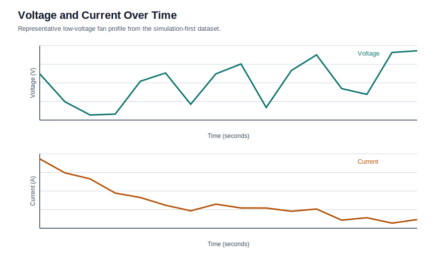
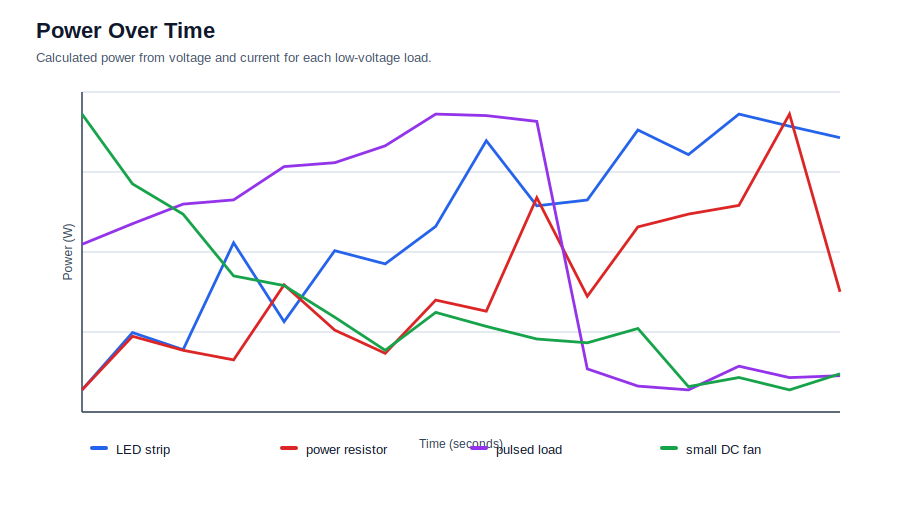
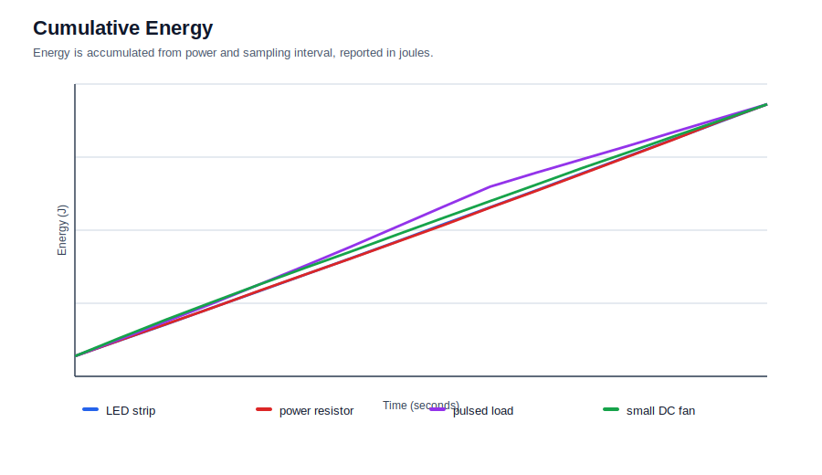
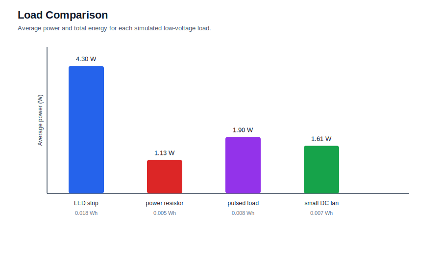

# Smart Energy Monitoring System

Low-cost Arduino/ESP32 energy monitoring prototype for voltage, current, power
logging, and Python-based energy-use analysis.

## Portfolio Summary

- Built a low-voltage energy monitoring workflow that records voltage/current data, calculates power and cumulative energy, and generates reviewer-ready plots.
- Used Arduino/ESP32 planning, INA219 sensor documentation, Python CSV analysis, SVG figures, and safety-aware hardware notes.
- Demonstrated the full analysis pipeline with simulated data while clearly marking the next validation step: real INA219 readings and prototype photos.

## Why This Project Matters

Energy monitoring is a practical Electrical and Computer Engineering project
because it combines circuit measurement, embedded sensors, data logging, and
software analysis. This prototype focuses on safe low-voltage DC loads while
demonstrating the same core calculations used in larger energy monitoring
systems.

## Prototype Overview

The system records voltage and current readings, calculates power, accumulates
energy over time, and exports plots that make load behavior easier to compare.

Current version:

- simulation-first dataset
- CSV cleaning and power calculation
- cumulative energy calculation
- SVG figures for voltage, current, power, and energy
- Arduino/ESP32 INA219 logger plan
- hardware safety documentation

## Hardware Design

The planned hardware version uses an Arduino or ESP32 with an INA219
current/voltage sensor module. The INA219 is connected over I2C and placed in
series with the positive supply line of a low-voltage DC load.

Recommended hardware:

- ESP32 or Arduino Uno/Nano
- INA219 current/voltage sensor
- breadboard and jumper wires
- low-voltage DC load such as an LED strip, small fan, resistor, or motor
- USB power and serial logging connection

See `hardware/materials_list.md`, `hardware/circuit_notes.md`, and
`hardware/wiring_diagram.svg`.

## Circuit Safety Note

This prototype measures low-voltage DC loads as a safe model of energy
monitoring. It does not measure household mains electricity, replace a
commercial smart meter, or monitor whole-home energy use.

Do not connect this circuit to wall outlets, breaker panels, or mains AC wiring.

## Data Collection Method

The Arduino/ESP32 logger prints serial CSV rows in this format:

```text
timestamp_ms,voltage_v,current_ma,power_mw
```

The Python analysis script accepts that serial format directly and converts
milliseconds to seconds and milliamps to amperes.

The analysis dataset uses:

```text
timestamp_s,voltage_v,current_a,power_w,energy_j,load_type,measurement_status,notes
```

Until hardware is available, the included data is marked as `simulated`.

## Analysis and Results

The Python workflow calculates:

- `power_w = voltage_v * current_a`
- `energy_j = sum(power_w * dt)`
- `watt_hours = energy_j / 3600`

Generated figures:









The generated text summary is saved at `analysis/analysis_summary.txt`.

Simulation run results:

| Load | Average Power | Peak Power | Total Energy |
| --- | ---: | ---: | ---: |
| LED strip | 4.300 W | 4.447 W | 64.72 J / 0.0180 Wh |
| small DC fan | 1.607 W | 1.866 W | 23.85 J / 0.0066 Wh |
| power resistor | 1.131 W | 1.221 W | 17.01 J / 0.0047 Wh |
| pulsed load | 1.904 W | 2.263 W | 28.56 J / 0.0079 Wh |

## Current Status

Simulation-first version complete. The repository is ready for hardware data
once an Arduino/ESP32, INA219 sensor, and low-voltage load are available.

## Real Data and Photo Next Step

The main next portfolio upgrade is to capture real INA219 readings from one or more low-voltage loads and add prototype photos of the wiring. A strong evidence package would include raw serial CSV output, cleaned CSV output, photos of the Arduino/ESP32 + INA219 setup, regenerated plots, and a short comparison between simulated and measured readings. The checklist is tracked in `docs/real_hardware_data_next_steps.md`.

## Limitations

- The current CSV data is simulated, not measured from real hardware.
- The circuit is designed only for low-voltage DC loads.
- Real sensor accuracy depends on wiring quality, calibration, sensor range,
  and the stability of the load and power source.

## Future Improvements

- Capture 30-60 seconds of real INA219 data.
- Add prototype photos.
- Compare multiple real loads.
- Add live plotting or a small dashboard.
- Add SD card logging for untethered measurements.
- Add calibration checks against a multimeter.

## Repository Structure

```text
smart-energy-monitoring-system/
|-- README.md
|-- hardware/
|   |-- materials_list.md
|   |-- circuit_notes.md
|   |-- wiring_diagram.svg
|   `-- prototype_photos/
|-- arduino/
|   `-- energy_logger_ina219.ino
|-- data/
|   |-- README.md
|   |-- raw_measurements.csv
|   |-- cleaned_measurements.csv
|   `-- simulated_measurements.csv
|-- analysis/
|   |-- energy_analysis.py
|   |-- analysis_summary.txt
|   `-- README.md
|-- figures/
|   |-- voltage_current_over_time.svg
|   |-- power_over_time.svg
|   |-- cumulative_energy.svg
|   `-- load_comparison.svg
|-- docs/
|   `-- reviewer_summary.md
`-- paper/
    `-- project_summary.md
```

## Skills Demonstrated

- electrical measurement planning
- embedded systems
- INA219 sensor workflow
- I2C communication
- serial data logging
- CSV data cleaning
- power and energy calculations
- Python analysis
- technical documentation
- safety-aware project scoping

## How to Run the Analysis

From the repository root:

```bash
python analysis/energy_analysis.py
```

No third-party Python packages are required.

The script regenerates `data/simulated_measurements.csv` each time, but it does
not overwrite `data/raw_measurements.csv` once that file exists. That keeps
future hardware captures safe.

## For Reviewers

This project is intentionally honest about its status. It already demonstrates
the complete analysis and documentation workflow, while the README and data
files clearly mark simulated readings until hardware measurements are added.

For a quick review, start with:

- `docs/reviewer_summary.md`
- `docs/verification_report.md`
- `analysis/analysis_summary.txt`
- `figures/load_comparison.svg`
- `arduino/energy_logger_ina219.ino`

For GitHub setup, use `docs/portfolio_publish.md`.
